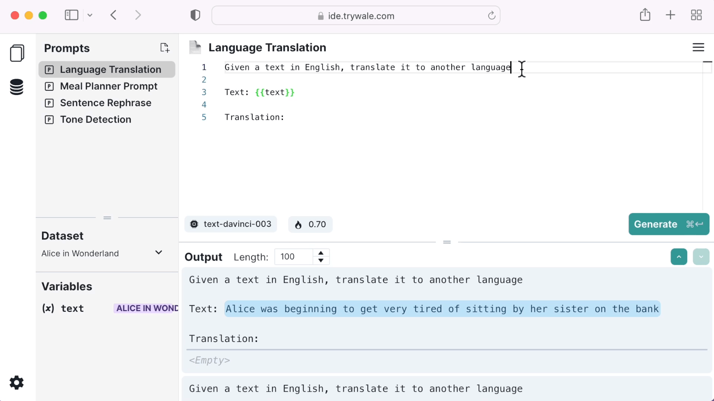
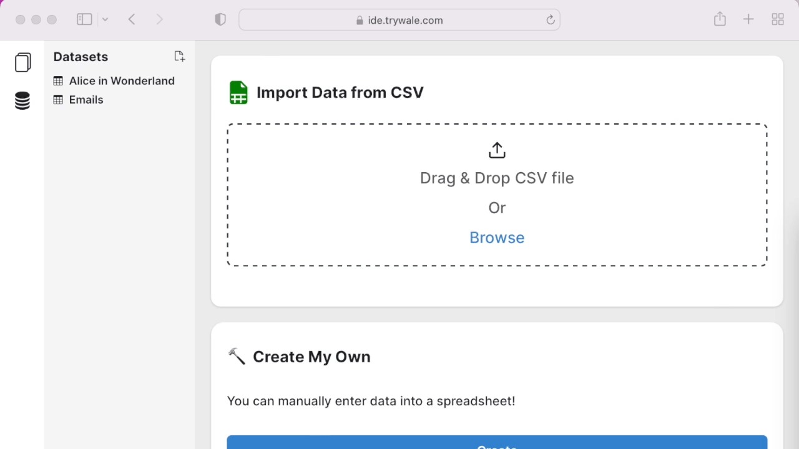
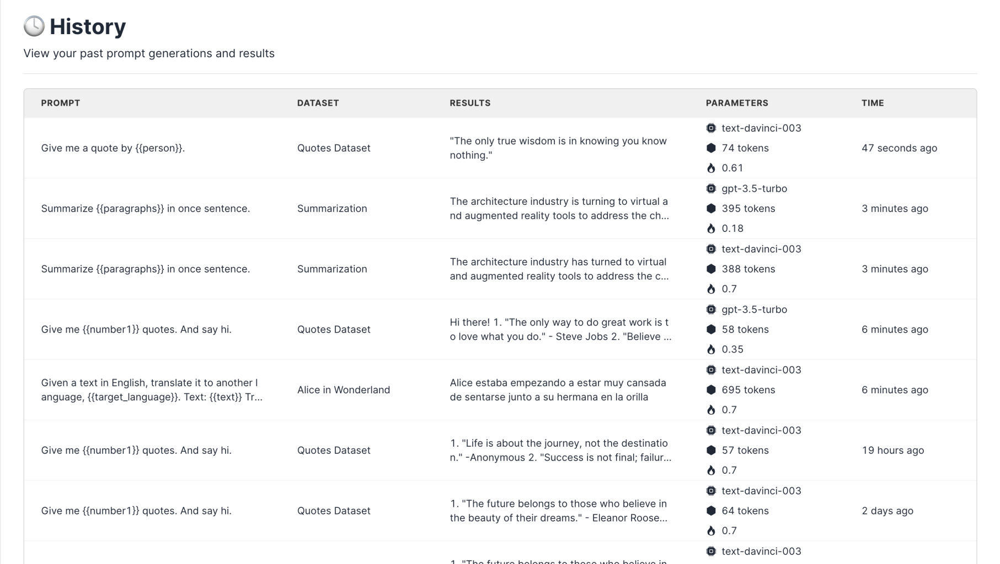

# 🔮 Prompt Playground

---

# 🧪 A/B Test with Data

Wale's unique prompt templating feature makes running prompts on multiple data points a breeze. You can create prompt templates to quickly generate and run prompts on all your data points. Our platform provides you with a user-friendly spreadsheet tool, which allows you to upload a CSV file or create custom data points for your prompts.

## 📑 Prompt Templating

Template data variables with double curly brackets.

## 🧩 Datasets

Upload csv or create your own spreadsheet.

## 🏃 Generation

Choose the correct dataset and run your prompt.

## 🕓 History

View your generation history.

