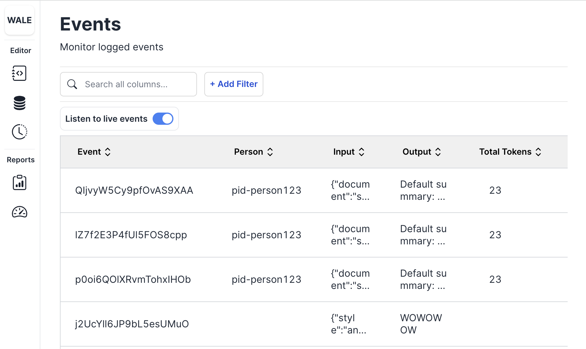

Check out our [example app](https://github.com/trywale/analytics-sdk/tree/master/examples/summarizer-backend) on GitHub to get started!

### Step 1: Install the Wale SDK Python package

```
pip install wale-sdk
```

### Step 2: Set up the Wale logger

Set up the Wale logger by initializing the Wale class with your Wale API Key. Get your Wale API key by visiting the [settings page](https://ide.trywale.com/settings)

Create a new script `main.py`:

```python
import openai
from wale import Wale

# Set your Wale API key
WALE_API_KEY = "<WALE_API_KEY>"
OPENAI_API_KEY = "<OPENAI_API_KEY>"
# Initialize the Wale logger
logger = Wale(api_key=WALE_API_KEY)

# Initialize OpenAI Key
openai.api_key = OPENAI_API_KEY
```

### Step 3: Call the logger

Once you have set up the Wale logger and generated the summary using OpenAI, you can use the Wale logger to log the input document and generated summary along with additional metadata. This can be done by calling `logger.log()` and passing in the `inputs`, `output`, `task_id`, `model_config`, `person_id`, and `total_tokens` as arguments. This will log the data to the Wale platform, allowing you to easily analyze and understand LLM calls.

```python
# Set the OpenAI engine and input document
model = "text-davinci-003"
document = "This is an example document that we want to summarize."
temperature = 0.5
max_tokens = 100

# Generate a summary using OpenAI
response = openai.Completion.create(
  model=model,
  prompt=f"Please summarize the following document for a 10 year old. Input: \n\n{document}. \n\nSummary:",
  temperature=temperature,
  max_tokens=max_tokens,
  n=1,
  stop=None
)

# Extract the summary and total tokens used
summary = response.choices[0].text.strip()
total_tokens = response.usage["total_tokens"]

# Log the input document and generated summary using the Wale logger
log_obj = logger.log(
  inputs={"document": document},
  output=summary,
  task_id="summarize",
  model_config={
    "model": model,
    "provider": "openai",
    "temperature": temperature,
    "max_tokens": max_tokens,
  },
  person_id="pid-person123",
  total_tokens=total_tokens,
)
print(log_obj['id'])
```

### Step 5: View your logs in the Wale dashboard

Once you have started logging data with the Wale SDK, you can view your logs in the Wale Events page:



The dashboard provides a detailed view of your logged data, allowing you to analyze and understand your LLM (language model) calls.

You can log in to the Wale dashboard using your Wale account credentials. Once you're logged in, you can view your logs, filter them, and export them for further analysis.
