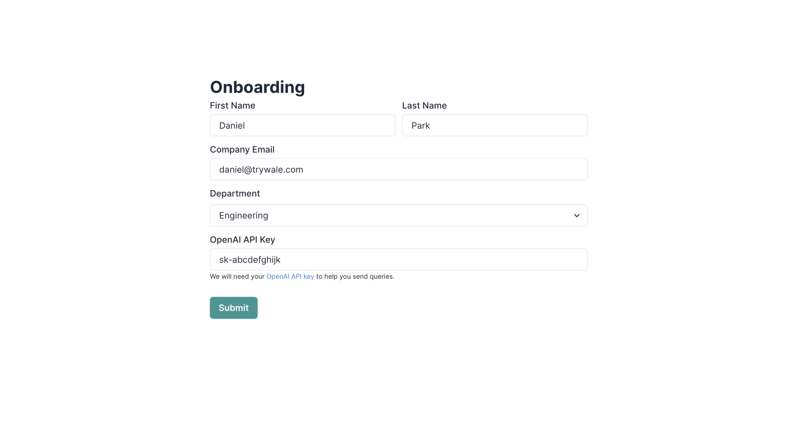

1. Visit [Wale](https://ide.trywale.com/login) and sign up with your Google account.

2. Complete the onboarding process.
   1. Visit [OpenAI API key](https://platform.openai.com/account/api-keys) to retrieve your OpenAI API key  
      

3. Start prompt engineering!
   1. Checkout [🎬 Quick Start - Playground](/docs/quick-start/playground-quick-tutorial.md) for a more detailed guide.

4. (Optional) Adjust the parameters to improve your prompts.

- 🔥 Temperature: A number between 0 and 1 that determines the randomness (creativity) of the responses
- 🤹 LLM Models: Currently, we provide three models that you can choose from:
  - 🎯 text-davinci-003
  - 💨 gpt-3.5-turbo
  - 🔋 fastchat-t5-3b (Open-source model)
- 💵 Maximum Length: Maximum number of tokens to generate