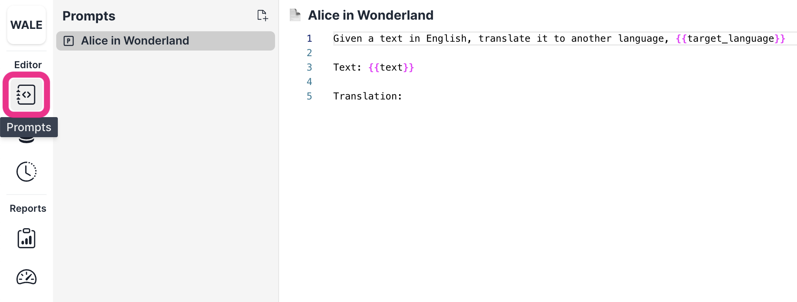

Let's try out the default 🐇Alice in Wonderland🦤 example.

1. Select the **Alice in Wonderland** prompt on the Prompt page.

   1. > 📘 If you can't see the list of prompts on the Prompt page, click on the Prompt icon in the sidebar under **Editor**.
      > 

2. In the Prompt page sidebar, choose the **Alice in Wonderland** dataset under the **Dataset** tab and run the prompts by clicking the **Generate** button. 

3. (Optional) Adjust the parameters to improve your prompts.

- 🔥 Temperature: A number between 0 and 1 that determines the randomness (creativity) of the responses
- 🤹 LLM Models: Currently, we provide three models that you can choose from:
  - 🎯 text-davinci-003
  - 💨 gpt-3.5-turbo
  - 🔋 fastchat-t5-3b (Open-source model)
- 💵 Maximum Length: Maximum number of tokens to generate

Watch Zach walk through this example!

<!-- Playground Quick Demo -->
<iframe width="560" height="315" src="https://www.youtube.com/embed/mTGAOX5yWo0" title="YouTube video player" frameborder="0" allow="accelerometer; autoplay; clipboard-write; encrypted-media; gyroscope; picture-in-picture; web-share" allowfullscreen></iframe>
