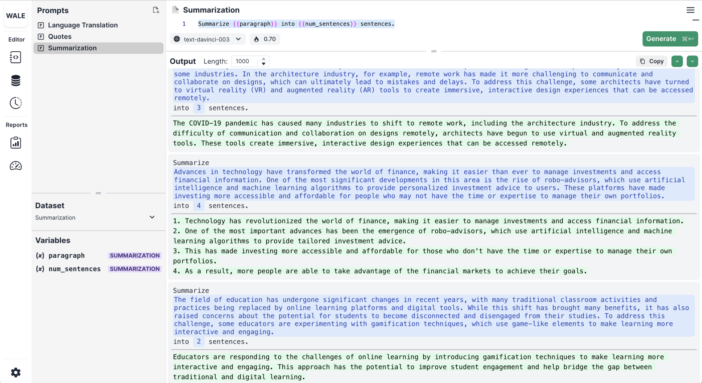
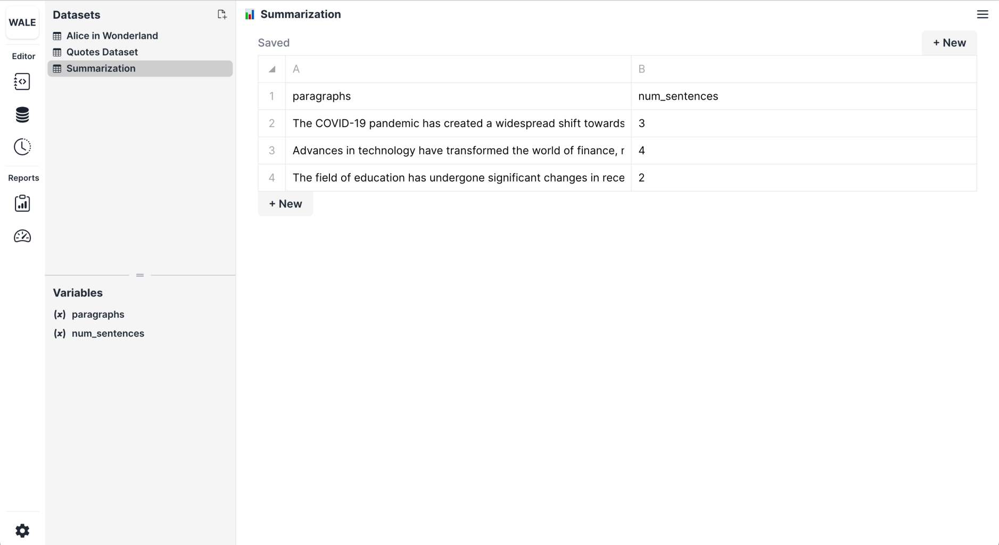

# 📝 Summarization

---

# Context

Build a prompt that will summarize paragraphs into a few sentences. In doing so, we want to give it a constraint, the number of sentences.

## Prompt

```
Summarize {{paragraph}} into {{num_sentences}} sentences.
```

Here are the paragraphs and the number of sentences we want to summarize each paragraph into.

## Dataset

| paragraph                                                                                                                                                                                                                                                                                                                                                                                                                                                                                                                                   | num_sentences |
| :------------------------------------------------------------------------------------------------------------------------------------------------------------------------------------------------------------------------------------------------------------------------------------------------------------------------------------------------------------------------------------------------------------------------------------------------------------------------------------------------------------------------------------------ | :------------ |
| The COVID-19 pandemic has created a widespread shift towards remote work, but this change has been particularly difficult for some industries. In the architecture industry, for example, remote work has made it more challenging to communicate and collaborate on designs, which can ultimately lead to mistakes and delays. To address this challenge, some architects have turned to virtual reality (VR) and augmented reality (AR) tools to create immersive, interactive design experiences that can be accessed remotely.          | 3             |
| Advances in technology have transformed the world of finance, making it easier than ever to manage investments and access financial information. One of the most significant developments in this area is the rise of robo-advisors, which use artificial intelligence and machine learning algorithms to provide personalized investment advice to users. These platforms have made investing more accessible and affordable for people who may not have the time or expertise to manage their own portfolios.                             | 4             |
| The field of education has undergone significant changes in recent years, with many traditional classroom activities and practices being replaced by online learning platforms and digital tools. While this shift has brought many benefits, it has also raised concerns about the potential for students to become disconnected and disengaged from their studies. To address this challenge, some educators are experimenting with gamification techniques, which use game-like elements to make learning more interactive and engaging. | 2             |

Let's see what this looks like in Wale!

**Wale's Prompt Page**



**Wale's Dataset Page**



🤗 Happy Prompting!
