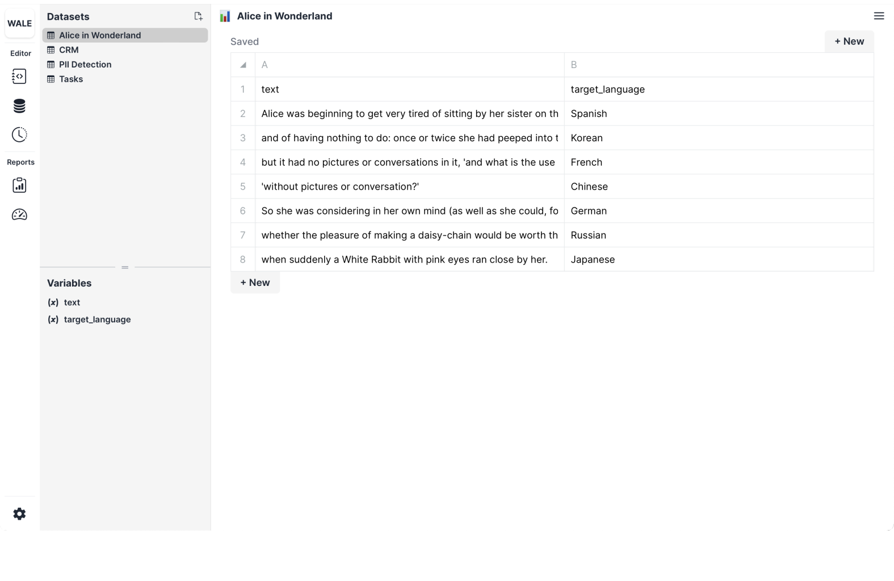
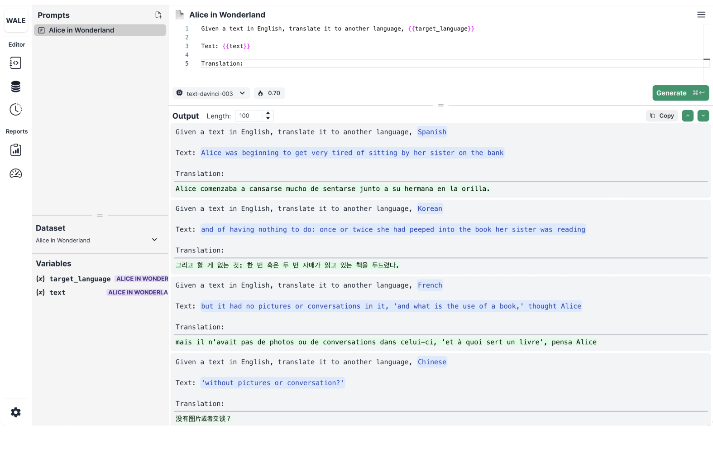

# 🌎 Translation

---

# Context

Build a prompt that will translate the first few lines of _Alice in Wonderland_ into different languages. In doing so, we want to test different prompts to see which one yields the best result. Let's start with this prompt.

## Prompt

```
Given a text in English, translate it to another language, {{target_language}}

Text: {{text}}

Translation:
```

Here are the first few lines of _Alice in Wonderland_ and the target languages we want to translate into.

## Dataset

| text                                                                                                                 | target_language |
| :------------------------------------------------------------------------------------------------------------------- | :-------------- |
| Alice was beginning to get very tired of sitting by her sister on the bank                                           | Spanish         |
| and of having nothing to do: once or twice she had peeped into the book her sister was reading                       | Korean          |
| but it had no pictures or conversations in it, 'and what is the use of a book,' thought Alice                        | French          |
| 'without pictures or conversation?'                                                                                  | Chinese         |
| So she was considering in her own mind (as well as she could, for the hot day made her feel very sleepy and stupid), | German          |
| whether the pleasure of making a daisy-chain would be worth the trouble of getting up and picking the daisies,       | Russian         |
| when suddenly a White Rabbit with pink eyes ran close by her.                                                        | Japanese        |

Let's see what this looks like in Wale!

**Wale's Prompt Page**



**Wale's Dataset Page**



🤗 Happy Prompting!
